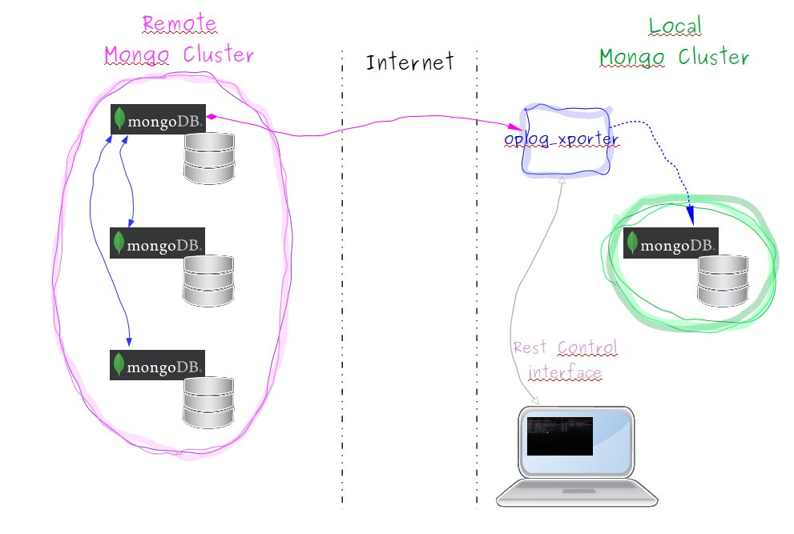
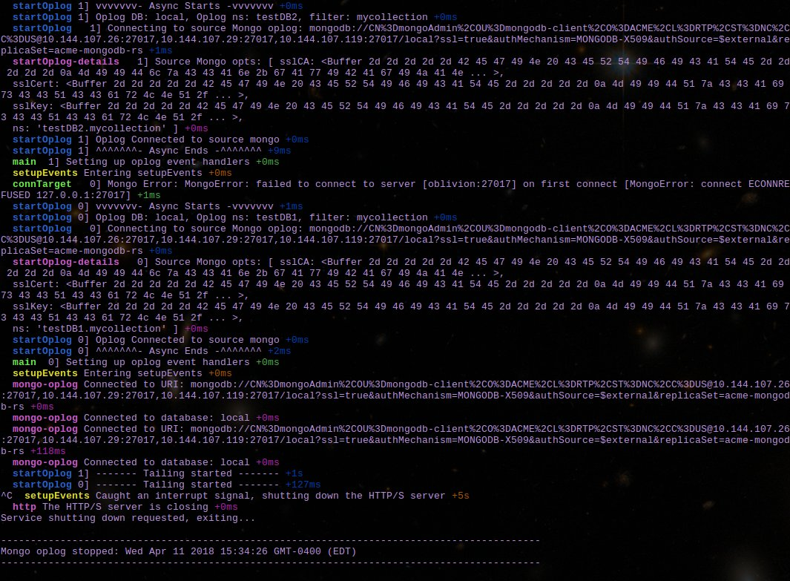

# Introduction
A front-end for the mongo-oplog that is already provided on GIT, see below for details.  This javascript enables you to specify a source and target environment for specific namespaces and documents you wish to keep synchronized between two environments.  It is most helpful when moving your data from an older set of VSIs or installation into another, perhaps provided by a service provider, after you have initially primed the new (target) installation using mongodump/restore.  



# License and Disclaimer
(The MIT License)

Copyright (c) 2017

Permission is hereby granted, free of charge, to any person obtaining a copy of this software and associated documentation files (the 'Software'), to deal in the Software without restriction, including without limitation the rights to use, copy, modify, merge, publish, distribute, sublicense, and/or sell copies of the Software, and to permit persons to whom the Software is furnished to do so, subject to the following conditions:

The above copyright notice and this permission notice shall be included in all copies or substantial portions of the Software.

THE SOFTWARE IS PROVIDED 'AS IS', WITHOUT WARRANTY OF ANY KIND, EXPRESS OR IMPLIED, INCLUDING BUT NOT LIMITED TO THE WARRANTIES OF MERCHANTABILITY, FITNESS FOR A PARTICULAR PURPOSE AND NONINFRINGEMENT. IN NO EVENT SHALL THE AUTHORS OR COPYRIGHT HOLDERS BE LIABLE FOR ANY CLAIM, DAMAGES OR OTHER LIABILITY, WHETHER IN AN ACTION OF CONTRACT, TORT OR OTHERWISE, ARISING FROM, OUT OF OR IN CONNECTION WITH THE SOFTWARE OR THE USE OR OTHER DEALINGS IN THE SOFTWARE.

# Preparation and Pre-requisites
As a pre-requisite you must install the following as peer projects, at same directory level as this one:
- https://github.com/cayasso/mongo-oplog : mongo-oplog-2.1.0

## Quick Guides and Overviews
The following are provided as quick video guides.
- 

# Deployment

## Native Linux
The nodejs application can be deployed as any other nodejs application.  It supports the following command-line parameters.
- json_file: argument providing full path to the json file containing the acceptable source and target environment configurations.
- source: argument key for the source environment to use.
- target: argument key for the target environment to use.

For example, once the project is built and placed on the machine where it will be used, which has access to both source and target environments, and you have updated the json for both environments, issue something like the following:
```
DEBUG=* node index.js etc/oplog_app.json remote localhost
```

### JSON file
In the etc directory is there is a JSON file that you will have to configure for your particular setup.  It currently provides for no-authentication, basic authentication and TLS certification type connections for source and target.  You will have to provide access to any certificates that the tool will need via the JSON file, as shown in the provided example.  The main certs that are given are provided for the HTTPS CLI REST interface to provide some control while the oplog mechanism is running.

# Control
The app contains a web server for REST calls which can be configured for either HTTP or HTTPS. It provides the following capabilities, as shown per the help message.

## Help
An example help REST call with HTTPS and JWT would look like the following.
```
$ curl -k --request GET -H "Authorization: JWT <token here>" -H "Accept: application/json" -H "Content-Type: application/json" https://localhost:8180/help
```


# Testing
There are several tests that are used to verify the application is sound.  A set of basic tests and another set of fake tests that exercise more difficult internal functions.

## Running Basic Tests
Basic tests can be run using the following command and a sample output is shown.




