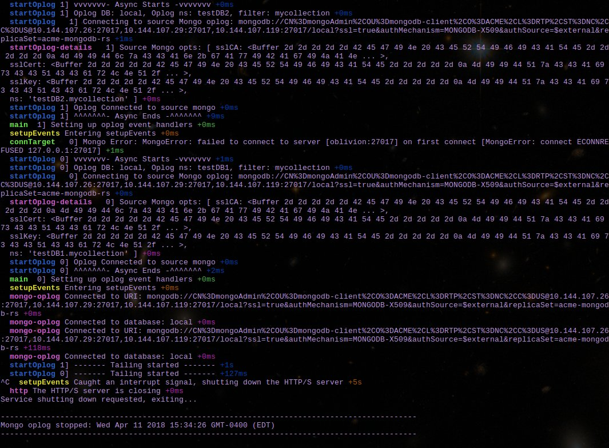

# Introduction

# Build
A Dockerfile is provided to create a usable docker container.  This supports both internal and external configurations through the use of envvars.


# Deployment

## Native Linux
The nodejs application can be deployed as any other nodejs application.  It supports the following command-line parameters.
- json_file: argument providing full path to the json file containing the acceptable source and target environment configurations.
- source: argument key for the source environment to use.
- target: argument key for the target environment to use.

## Docker

### Using Environment Variables
In order to deploy using scripts you must use some environment variables. The following environment variables are used by the scripts to perform deploy- and undeployments.
<p>
<ol>
<li>[optional] Common docker container related options, DOCKER_COMMON_OPTS, see Docker documentation for details.  An example is provided below, but the specific below options are not recommended.
<ul>
<li>export DOCKER_COMMON_OPTS="-a stdin -a stdout"
</ul>
<p>
<li>[optional] Set the oplog json file to use, OPLOG_ARGS.
<ul>
<li>export OPLOG_ARGS="/shared/oplog"
</ul>
<p>
</ol>

# Control
The oplog-app contains a web server for REST calls which can be configured for either HTTP or HTTPS. It provides the following capabilities, as shown per the help message.

## Help
An example help REST call with HTTPS and JWT would look like the following.
```
$ curl -k --request GET -H "Authorization: JWT <token here>" -H "Accept: application/json" -H "Content-Type: application/json" https://localhost:8180/help
```


# Testing
There are several tests that are used to verify the application is sound.  A set of basic tests and another set of fake tests that exercise more difficult internal functions.

## Running Basic Tests
Basic tests can be run using the following command and a sample output is shown.




